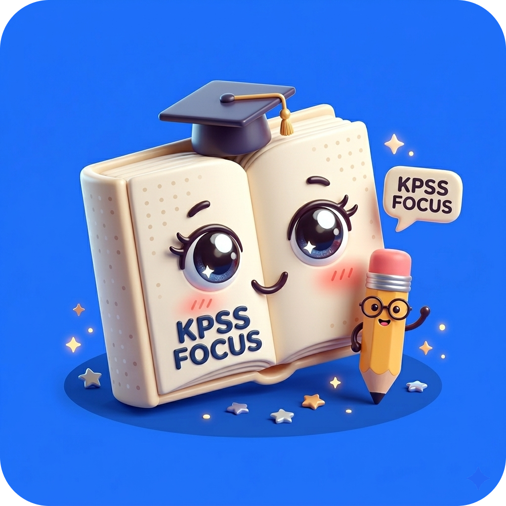
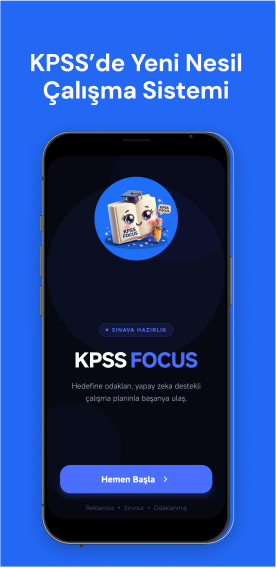
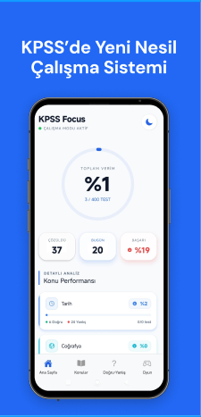
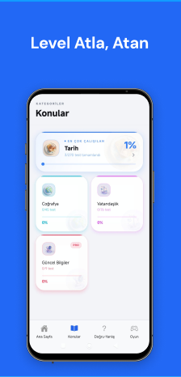
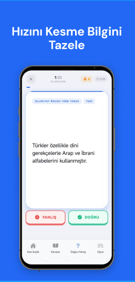
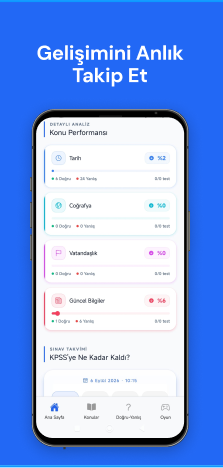
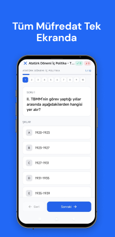
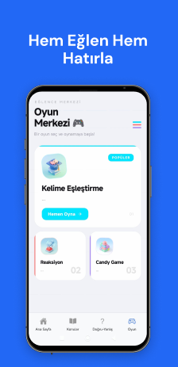

# 🎯 KPSS Focus




**KPSS Focus**, Kamu Personeli Seçme Sınavı'na hazırlanan adayların çalışma süreçlerini optimize etmeleri, süre takibi yapmaları ve gelişimlerini analiz etmeleri için tasarlanmış modern bir mobil asistan uygulamasıdır.  
*Hedefine odaklan, süreni yönet ve başarıya ulaş!*

---

## 📚 İçindekiler
- [✨ Özellikler](#-özellikler)
- [🛠 Kullanılan Teknolojiler](#-kullanılan-teknolojiler)
- [⚙️ Kurulum](#-kurulum)
- [🚀 Kullanım](#-kullanım)
- [📸 Proje Görselleri](#-proje-görselleri)
- [🎬 Proje Videosu](#-proje-videosu)
- [🤝 Katkıda Bulunma](#-katkıda-bulunma)
- [📄 Lisans](#-lisans)
- [📬 İletişim](#-iletişim)

---

## ✨ Özellikler
- ✅ **Pomodoro Sayacı:** KPSS konularına özel özelleştirilebilir çalışma ve mola süreleri.
- ✅ **Konu Takip Sistemi:** Hangi konudan kaç soru çözüldüğünü ve eksik konuları anlık takip etme.
- ✅ **İstatistikler & Grafikler:** Günlük, haftalık ve aylık çalışma performansını görselleştirme.
- ✅ **Hatırlatıcı Bildirimler:** Günlük çalışma hedeflerini unutmamak için akıllı bildirimler.
- ✅ **Karanlık Mod Desteği:** Gece çalışmalarında göz yormayan arayüz seçeneği.

---

## 🛠 Kullanılan Teknolojiler

| Alan | Teknoloji |
| :--- | :--- |
| **Framework** | React Native (Expo) |
| **Dil** | JavaScript / TypeScript |
| **State Management** | Redux Toolkit / Context API |
| **Veritabanı & Auth** | Firebase (Firestore & Auth) |
| **UI Kütüphanesi** | React Paper / NativeWind (Tailwind) |
| **Grafikler** | React Native Chart Kit |

---

## ⚙️ Kurulum

Projeyi yerel makinenizde çalıştırmak için aşağıdaki adımları izleyin.

### Gereksinimler
- Node.js (v16 veya üzeri)
- npm veya yarn
- Expo Go uygulaması (Mobil cihazda test etmek için)

### Adımlar
1. **Depoyu klonlayın:**
   ```bash
   git clone https://github.com/erenkirekbilek/kpss-focus.git
   cd kpss-focus
   ```

2. **Bağımlılıkları yükleyin:**
   ```bash
   npm install
   ```

3. **Uygulamayı başlatın:**
   ```bash
   npm start
   ```

4. **Expo Go ile çalıştırın:**
   - React Native emulatorunuz varsa: `npm run android` veya `npm run ios`
   - Mobil cihazda test etmek için Expo Go uygulamasını kullanın

---

## 🚀 Kullanım

1. **Hoş Geldiniz:** Uygulamayı ilk açtığınızda karşınıza hoş geldiniz ekranı çıkar.
2. **Ana Sayfa:** Pomodoro sayacınız, günlük istatistikleriniz ve hızlı erişim butonları burada yer alır.
3. **Konular:** KPSS konularınızı ekleyebilir, her konu için soru sayınızı takip edebilirsiniz.
4. **True-False:** Doğru/Yanlış soru çalışmalarınızı burada yapabilirsiniz.
5. **İstatistikler:** Performansınızı grafiklerle analiz edebilirsiniz.
6. **Oyun:** Dinlenme molası için eğlenceli mini oyunlar oynayabilirsiniz.

---

## 📸 Proje Görselleri

| Sayfa | Görsel |
| :--- | :--- |
| Welcome |  |
| Ana Sayfa |  |
| Konular |  |
| True-False |  |
| İstatistikler |  |
| Sorular |  |
| Eğlence |  |

---

## 🎬 Proje Videosu

.
---

## 🤝 Katkıda Bulunma

Katkıda bulunmak isterseniz, lütfen bir "pull request" oluşturun veya "issues" bölümünden bildirin.

---

## 📄 Lisans

Bu proje [MIT Lisansı](./LICENSE) ile lisanslanmıştır.

---

## 📬 İletişim

- **E-posta:** erenzirekbilek@hotmail.com
- **GitHub:** [https://github.com/erenkirekbilek/kpss-focus](https://github.com/erenkirekbilek/kpss-focus)